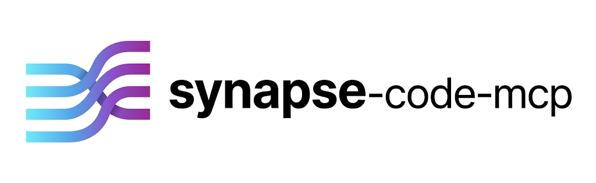

<p align="center">
  <picture>
    <source media="(prefers-color-scheme: dark)" srcset="docs/logo-dark.png">
    <source media="(prefers-color-scheme: light)" srcset="docs/logo-light.png">
    
  </picture>
</p>

# Synapse MCP

[](https://github.com/Eltortilla1/synapse-code-mcp/actions/workflows/ci.yml)
[](LICENSE)
[](https://nodejs.org)
[](#development)

> A structural code context server that connects your local repository to AI assistants via the [Model Context Protocol](https://modelcontextprotocol.io).

Instead of copy-pasting files into a prompt, Synapse lets your AI assistant dynamically explore your codebase — pulling only the code it needs, when it needs it. The result: less context waste, smarter answers, and a workflow that scales to large projects — with no vector database or embedding API to set up.

```
AI Assistant  ──MCP──►  Synapse MCP  ──fs/git──►  Your Repository
   (pulls)               (server)                   (local)
```

> **Status:** Early-stage, actively developed. Contributions and bug reports are welcome — see [Contributing](#contributing).

---

## Why Synapse?

Most AI coding tools already index files. Synapse solves a different problem: **context quality at scale**.

| Problem | Synapse solution |
|---|---|
| Reading an entire file when you only need its API surface | `get_semantic_context` with `outline_only` — signatures only, ≤ 50% of full content |
| AI doesn't know what files exist in an unfamiliar project | `get_project_index` — full symbol map at ≤ 40% of raw source size, one call |
| "Review my changes" requires pasting the diff manually | `get_changed_files` — structured git diff, git-aware by default |
| Dependency rabbit holes filling the context window | Configurable `depth` cap on import traversal |

The compression ratios above are enforced as automated test budgets — not marketing estimates.

### Why not vector embeddings?

Most code-context MCP servers use semantic search backed by a vector database (e.g. Milvus, Qdrant) and an embedding API (OpenAI, VoyageAI). That gives them a real capability Synapse doesn't have: finding code by conceptual meaning ("find the authentication logic") rather than by structure or text.

Synapse trades that capability for a different set of properties:

- **Zero external dependencies** — no API keys, no vector database, no embedding provider to configure
- **Zero recurring cost** — no per-token embedding charges, no hosted database bill
- **Fully local and deterministic** — the same input always produces the same output, nothing leaves your machine, nothing to index ahead of time
- **Instant on any repo** — no indexing step before first use (see [Performance](#performance): 120–257 ms on real repos)

If you need natural-language semantic search across millions of lines in many languages, a vector-backed server is the better tool. If you want structural context (signatures, dependency graphs, diffs) without standing up infrastructure, Synapse is built for that.

---

## Tools

### `get_project_index`
Returns a compressed semantic map of the entire project: all exported functions, classes, interfaces, and types with their signatures — no bodies. The right first call when exploring an unfamiliar codebase.

```
# Project Index: my-app (47 files, 312 symbols)

## src/services/user-service.ts
  UserService (class) [export]
    constructor(db: Database)
    findById(id: string): Promise<User | null>
    create(data: CreateUserDto): Promise<User>

## src/models/user.ts
  User (interface) [export]
    id: string
    email: string
    createdAt: Date
  createUser(data: Partial<User>): User [export]
```

**Parameters:** `file_pattern` (glob to narrow scope), `include_non_exported`, `output_format` (`"markdown"` default · `"json"` for structured output)

Use `output_format: "json"` to get the raw symbol data as a structured object, which is easier to post-process programmatically:

```json
{
  "root": "/path/to/project",
  "totalFiles": 47,
  "totalSymbols": 312,
  "files": [
    {
      "relativePath": "src/services/user-service.ts",
      "language": "typescript",
      "symbols": [...]
    }
  ]
}
```

> **Large projects:** output grows linearly with the number of exported symbols. For monorepos or projects with 500+ files, use `file_pattern` to scope the index to one area at a time — e.g. `"src/services/**/*.ts"`.

---

### `get_semantic_context`
Returns a file's content alongside its local dependency graph — everything the AI needs to understand the code in context.

Add `outline_only: true` to get signatures without implementation bodies. Output is enforced by the benchmark suite to be ≤ 50% of full content length, while preserving full structural understanding.

**Parameters:** `file_path` (required), `depth` (import hops, default: 2), `outline_only`, `output_format` (`"markdown"` default · `"json"` for structured output)

---

### `get_changed_files`
Lists files changed since a git ref, grouped by status (Added / Modified / Deleted / Renamed), with optional line counts and full unified diff.

```
Changed files since `main` (8 files):

**Added (2):**
  src/services/payment.ts (+120 −0)
  tests/unit/payment.test.ts (+89 −0)

**Modified (5):**
  src/models/order.ts (+14 −3)
  ...

**Summary:** +245 −18 lines
```

**Parameters:** `base_ref` (default: `HEAD~1`), `include_diff`, `file_pattern`

---

### `get_project_tree`
Structured view of the repository, respecting `.gitignore` rules.

**Parameters:** `path`, `max_depth`, `show_hidden`

---

### `search_codebase`
Fast text or regex search across the project, returning matches with file paths and line numbers. Uses [ripgrep](https://github.com/BurntSushi/ripgrep) when available, falls back to a pure Node.js scanner.

**Parameters:** `query` (required), `file_pattern`, `is_regex`, `max_results`

---

## Language support

Synapse uses [ts-morph](https://ts-morph.com) (TypeScript compiler API) for deep analysis of TypeScript and JavaScript. For other languages, it applies regex-based extraction of function and class names.

| Feature | TypeScript / JS | Python · Go · Rust | Other |
|---|---|---|---|
| `get_project_tree` | ✓ | ✓ | ✓ |
| `search_codebase` | ✓ | ✓ | ✓ |
| `get_semantic_context` — full source | ✓ | ✓ | ✓ |
| `get_semantic_context` — dependency graph | ✓ | — | — |
| `get_semantic_context outline_only` | ✓ full signatures | ✓ names only | — |
| `get_project_index` | ✓ full signatures | ✓ names only | — |

Dependency graph traversal (following `import`/`require` chains) is TypeScript/JavaScript only. For all other languages, Synapse still reads and searches files normally — it just won't walk the import graph.

> **Limitation:** dependency graph traversal only follows *relative* imports (`./foo`, `../bar`). Path aliases configured via `tsconfig.json` `paths` (e.g. `@/components/Foo`) are not resolved and will be silently skipped — the dependency graph will be incomplete for projects that rely heavily on aliased imports. Support for resolving aliases is tracked in the [roadmap](ROADMAP.md).

---

## Installation

**Global install (recommended):**
```bash
npm install -g synapse-code-mcp
```

**Run without installing:**
```bash
npx synapse-code-mcp --root /path/to/your/project
```

---

## Setup

### Claude Desktop

Add to `~/Library/Application Support/Claude/claude_desktop_config.json` (macOS) or `%APPDATA%\Claude\claude_desktop_config.json` (Windows):

```json
{
  "mcpServers": {
    "synapse": {
      "command": "npx",
      "args": ["synapse-code-mcp", "--root", "/absolute/path/to/your/project"]
    }
  }
}
```

### Claude Code (CLI)

```bash
claude mcp add synapse -- npx synapse-code-mcp --root /path/to/your/project
```

Or add directly to `~/.claude/settings.json`:

```json
{
  "mcpServers": {
    "synapse": {
      "command": "npx",
      "args": ["synapse-code-mcp", "--root", "/path/to/your/project"]
    }
  }
}
```

### Cursor

Add to `.cursor/mcp.json` in your home directory or project root:

```json
{
  "mcpServers": {
    "synapse": {
      "command": "npx",
      "args": ["synapse-code-mcp", "--root", "/path/to/your/project"]
    }
  }
}
```

### Windsurf

Add to `~/.codeium/windsurf/mcp_config.json`:

```json
{
  "mcpServers": {
    "synapse": {
      "command": "npx",
      "args": ["synapse-code-mcp", "--root", "/path/to/your/project"]
    }
  }
}
```

> **Tip:** Replace `/path/to/your/project` with the absolute path to the repository you want to serve. You can run multiple Synapse instances — one per project — each with a different key under `mcpServers`.

---

## Configuration

### CLI flags

```
Options:
  --root <path>                  Project root directory (default: cwd)
  --max-file-size <bytes>        Skip files larger than this (default: 524288 = 512 KB)
  --max-search-results <n>       Cap on search results returned (default: 50)
  --max-tree-depth <n>           Maximum directory depth for tree view (default: 5)
  --max-dependency-depth <n>     Import hops for semantic context (default: 2)
  --log-level <level>            debug | info | warn | error (default: info)
```

### Per-project config file

Drop a `synapse.config.json` at your project root to override defaults for that project:

```json
{
  "maxFileSize": 1048576,
  "maxDependencyDepth": 3,
  "extraIgnorePatterns": ["*.generated.ts", "**/__mocks__/**"]
}
```

All fields are optional. CLI flags take precedence over `synapse.config.json`.

### Performance

Measured on real open-source TypeScript repositories (single run, `--depth 1` clone, no warm cache):

| Repository | Files indexed | Time | Heap growth |
|---|---|---|---|
| [zod](https://github.com/colinhacks/zod) | 55 | **120 ms** | 3 MB |
| [TypeScript compiler](https://github.com/microsoft/TypeScript) `src/` | 247 | **257 ms** | 24 MB |

The automated benchmark suite enforces upper bounds on a synthetic fixture (3 000 minimal `.ts` files) to catch regressions under worst-case conditions:

| Operation | CI budget (synthetic fixture) |
|---|---|
| `get_project_tree` — 3 000 files | 5 s |
| `get_semantic_context` — depth 3 | 10 s |
| `get_changed_files` | 2 s |
| `get_project_index` — 60 files | 30 s |
| `get_project_index` — 600 files | 120 s |

The CI budgets are deliberately generous safety margins, not performance estimates — they exist to catch catastrophic regressions (e.g. an accidental O(n²) bug), not to predict real-world timing. The real-repo numbers above are the meaningful reference for expected performance. For large monorepos (1 000+ files), use `file_pattern` to scope the index to one area at a time.

---

## Security

Synapse is a **read-only** server. It never writes to the filesystem or modifies the git repository.

- **Path traversal protection** — every file read goes through `resolveAndValidate(root, path)`, which throws a `PATH_ESCAPE` error if the resolved path escapes the project root. The AI client receives the error code, never the file contents.
- **Root scoping** — only the directory tree under `--root` is accessible. Paths pointing outside (e.g. `../../etc/passwd`) are rejected at the validation layer.
- **File size cap** — files larger than `maxFileSize` (default 512 KB) are rejected before reading.
- **Binary detection** — compiled artifacts and binary files are detected and skipped automatically.
- **No outbound network calls** — Synapse communicates only over the local stdio pipe to the MCP client. It makes no HTTP requests.

---

## Suggested workflows

**Explore a new codebase:**
```
1. get_project_index()
   → Understand the full shape of the project in one call

2. get_semantic_context("src/core/engine.ts", outline_only: true)
   → Inspect a module's API surface without reading implementation

3. get_semantic_context("src/core/engine.ts")
   → Read full source + dependency graph for the relevant file
```

**Code review before a PR:**
```
1. get_changed_files(base_ref: "main")
   → See what changed, grouped and summarised

2. get_changed_files(base_ref: "main", include_diff: true)
   → Full unified diff in context

3. get_semantic_context("src/changed-file.ts")
   → Understand the context around a changed file
```

**Debug a feature:**
```
1. search_codebase("handlePayment")
   → Find where the symbol is defined and used

2. get_semantic_context("src/services/payment.ts", depth: 3)
   → Pull the file + all its local dependencies
```

---

## Requirements

- **Node.js ≥ 18**
- **Git** — required only for `get_changed_files`
- **[ripgrep](https://github.com/BurntSushi/ripgrep)** *(optional)* — significantly faster search; Synapse falls back to a pure Node.js scanner if `rg` is not on `$PATH`

---

## Development

```bash
git clone https://github.com/Eltortilla1/synapse-code-mcp.git
cd synapse-code-mcp
npm install

npm run dev          # watch mode (tsx, no compile step)
npm test             # run all tests (Vitest)
npm run typecheck    # type-check without emitting
npm run lint         # ESLint
npm run build        # compile to dist/
```

### Test with MCP Inspector

```bash
npm run build
npx @modelcontextprotocol/inspector dist/index.js --root .
```

This opens a browser UI where you can invoke all tools interactively and inspect their input/output.

### Project structure

```
src/
  index.ts              CLI entry point, argument parsing
  server.ts             MCP server, tool registration
  tools/                Thin tool handlers (validation + formatting only)
  core/
    fs/                 File tree building, file reading, ignore resolution
    search/             ripgrep adapter + pure-Node fallback
    analysis/           Dependency graph (ts-morph), outline extractor, project indexer
    git/                Git adapter (diff, changed files)
  config/               Config loading and Zod validation
  types/                Shared TypeScript interfaces
  utils/                Logger (pino), path helpers, typed errors
tests/
  unit/                 Per-module unit tests
  integration/          Tool handler integration tests
  protocol/             End-to-end MCP protocol tests (InMemoryTransport)
  performance/          Benchmark suite with time and heap budgets
```

---

## Roadmap

See [ROADMAP.md](ROADMAP.md) for what is planned and what ideas are open for community contributions.

---

## Contributing

This project is in active early development. Bug reports, feature requests, and pull requests are all welcome — the codebase is intentionally small and straightforward to navigate.

- [CONTRIBUTING.md](.github/CONTRIBUTING.md) — how to set up the environment, run tests, commit conventions, and architectural rules
- [CODE_OF_CONDUCT.md](CODE_OF_CONDUCT.md) — community standards (Contributor Covenant 2.1)
- [ROADMAP.md](ROADMAP.md) — what is planned and what is open for community PRs

New to the project? Browse issues tagged [`good first issue`](https://github.com/Eltortilla1/synapse-code-mcp/issues?q=is%3Aissue+is%3Aopen+label%3A%22good+first+issue%22) for the best entry points.

---

## License

[MIT](LICENSE)
